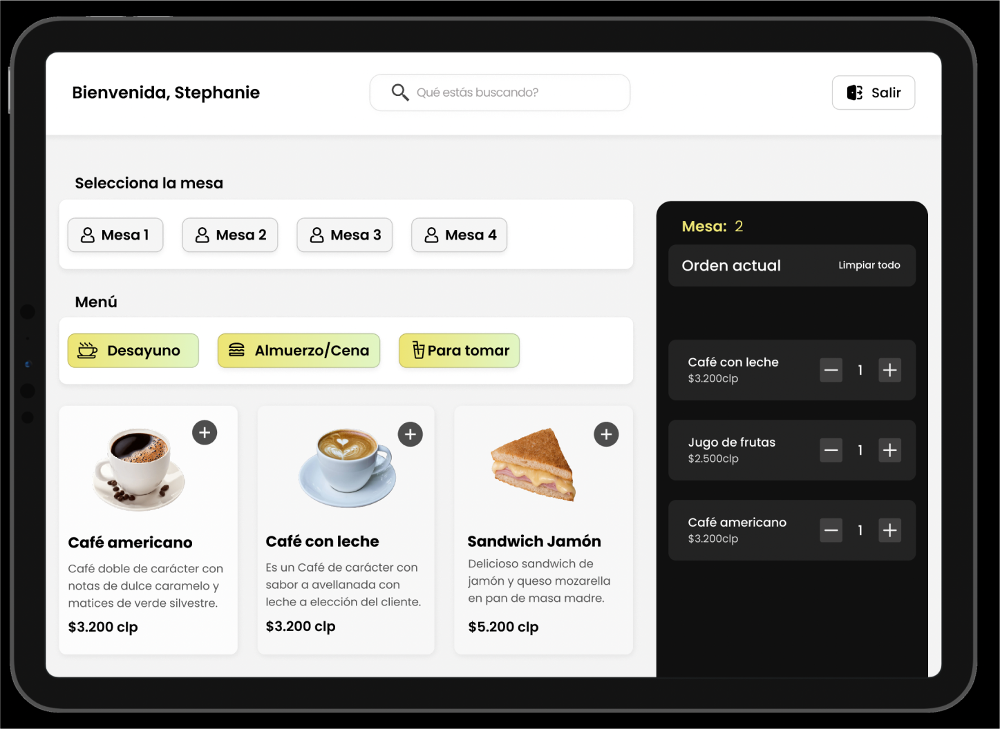
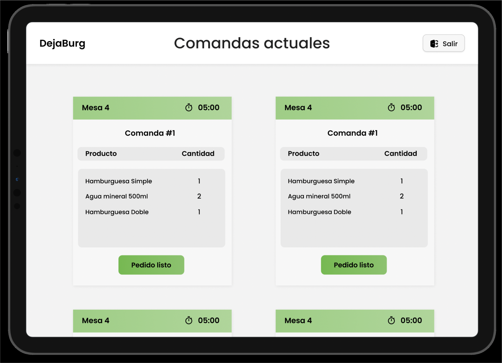

# Burger Queen

## 1. Resumen del proyecto

Un pequeño restaurante de hamburguesas, que está creciendo, necesita una
interfaz en la que puedan tomar pedidos usando una _tablet_, y enviarlos
a la cocina para que se preparen ordenada y eficientemente.

La interfaz debe mostrar el menú existente en la carta con sus respectivos productos. El mesero debe poder ir eligiendo qué _productos_ agregar y la interfaz debe ir mostrando el _resumen del pedido_ con el
costo total.

---

## 2. Objetivo del proyecto

El objetivo principal de este proyecto es aprender a construir una _interfaz web_
implementando como librería de JavaScript React el cual nos permite mantener la interfaz y el estado sincronizados.

---

## 3. Historias de usuario

#### [Historia de usuario 1] Mesero/a debe poder tomar pedido de cliente

Yo como meserx quiero tomar el pedido de un cliente para no depender de mi mala
memoria, para saber cuánto cobrar, y enviarlo a la cocina para evitar errores y
que se puedan ir preparando en orden.

### Criterios de aceptación

Lo que debe ocurrir para que se satisfagan las necesidades del usuario)

- Agregar productos al pedido.
- Eliminar productos.
- Ver resumen y el total de la compra.
- Enviar pedido a cocina (guardar en alguna base de datos).

---

#### [Historia de usuario 2] Jefe de cocina debe ver los pedidos

Yo como jefx de cocina quiero ver los pedidos de los clientes en orden y
marcar cuáles están listos para saber qué se debe cocinar y avisar a lxs meserxs
que un pedido está listo para servirlo a un cliente.

##### Criterios de aceptación

- Ver los pedidos ordenados según se van haciendo.
- Marcar los pedidos que se han preparado y están listos para servirse.
- Ver el tiempo que tomó prepara el pedido desde que llegó hasta que se
  marcó como completado.

---

#### [Historia de usuario 3] Meserx debe ver pedidos listos para servir

Yo como meserx quiero ver los pedidos que están preparados para entregarlos
rápidamente a los clientes que las hicieron.

##### Criterios de aceptación

- Ver listado de pedido listos para servir.
- Marcar pedidos que han sido entregados.

---

## 4. Prototipo de alta fidelidad

